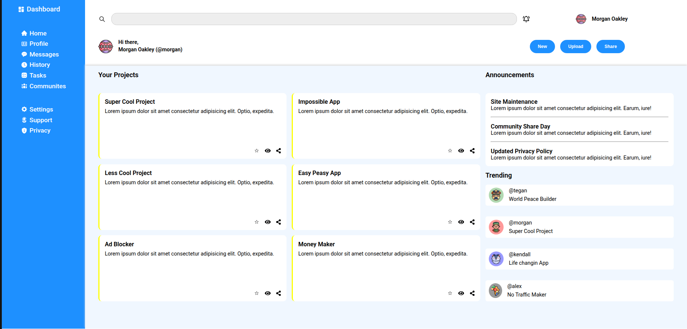

# Admin Dashboard

This project is part of the practice assignments from **The Odin Project: Intermediate HTML and CSS**.

The goal of this project is not to build a fully functional **Admin Dashboard**, but to practice using **CSS Grid and flexbox** to create and structure a dashboard layout.

## Live Demo
[View Live Admin Dashboard] (https://aliousang.github.io/admin-dashboard/)

## Features

- A main grid container for organising the layout into three sections. 
- A sidebar section for navigation and branding.
- A header section for the search bar, user information, and buttons.
- A main content section for announcements and trends.

## Technologies Used

- **HTML5**: Semantic layout and dashboard structure.
- **CSS3**: CSS Grid and Flexbox for layout, positioning, and interactive button states.
- **Fonts**: Used **Roboto** from Google Fonts.
- **Icons**: Used SVG and PNG images for icons.

## What I have Learned

- **Layout Organisation with Grid**: Using CSS grid to structure and position content in a well-organised layout.
- **When to Use Flexbox vs. Grid**: Using Grid for two-dimentional layouts and Flexbox for one-dimentional layouts.
